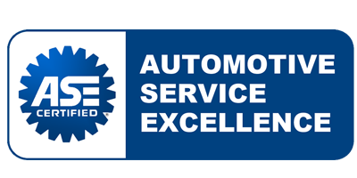

title: Basic Example
author:
  name: Jeff Turner
  twitter: JeffroeBodine
  url: http://sparkoverflow.com
output: DontGetScrewed.html
controls: true
--
# Mechanics. Friend or Foe?
## How not to get ripped off.
### A 47 part series.
--
### What is this?

--
### How about this?

--
### Last one?

--
# Rule #1
## Get more than one opinion
--
# Rule #2
## If you can't get another opinion. At least don't get up-sold
--
# Rule #3
## Do some research
http://www.napaautocare.com/estimator.aspx
--
# Rule 4
## Are they certified?

--
## Certifications
Auto Maintenance, Light, Med, and Heavy Truck, Bus

Damage Analysis, Consultant, Collision

Alternate Fuels, Diesel, Hybrid

Engine Machinist, Engine Performance, Exhaust

Parts Specialist
--
# Rule 5

## Ask for your old parts
